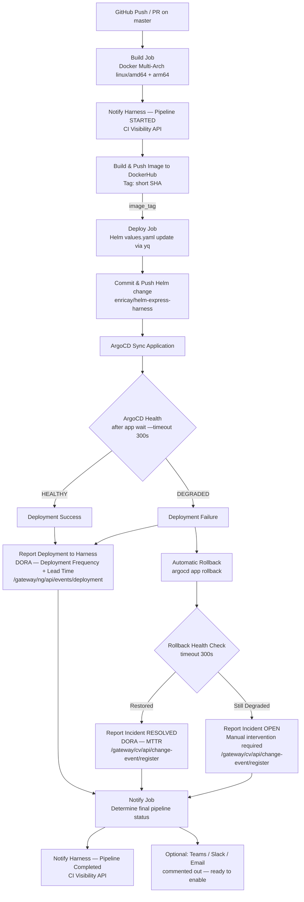

# CI/CD Pipeline — express-harness

## Overview

This pipeline runs on GitHub Actions and covers the full delivery lifecycle for the `express-harness` application: Docker image build, GitOps-based deployment via ArgoCD, automatic rollback on failure, and DORA metrics reporting to Harness.

---

## Trigger Conditions

| Event | Build | Deploy |
|---|---|---|
| `push` to `master` | ✅ Builds + pushes image | ✅ Deploys to production |
| `pull_request` targeting `master` | ✅ Builds image (no push) | ⛔ Skipped |

> Concurrency is enforced per branch — a new run cancels any in-progress run on the same ref.

---

## Pipeline Flowchart

---

## Jobs

### 1. `build`

| Step | Description |
|---|---|
| Notify Harness — Pipeline Started | Sends `STARTED` event to Harness CI Visibility API with commit metadata |
| Setup Docker Buildx | Enables multi-platform builds |
| Generate Image Tag | Short SHA (`${GITHUB_SHA::7}`) — deterministic, traceable |
| Login to DockerHub | Skipped on PRs |
| Build and Push Multi-Arch Image | Builds `linux/amd64` + `linux/arm64`, uses GHA layer cache |

**Output:** `image_tag` — passed to the `deploy` job.

---

### 2. `deploy`

> Only runs on `push` to `master` (skipped for PRs).

| Step | Description |
|---|---|
| Checkout Helm Repo | Checks out `enricay/helm-express-harness` |
| Install yq | Downloads `mikefarah/yq` for safe YAML editing |
| Update Image Tag | `yq e '.image.tag = "..."'` — surgically updates only `.image.tag` |
| Commit Helm Change | Commits and pushes updated `values.yaml` to the Helm repo |
| Install ArgoCD CLI | Downloads latest ArgoCD CLI binary |
| ArgoCD Sync Application | Logs in, then captures `deploy_started_at` **after login / before sync** for accurate Lead Time. Syncs and waits up to 5 minutes for health |
| Report Deployment to Harness | Posts to `/gateway/ng/api/events/deployment` with `startedAt`, `endedAt`, `artifactTag`, `commitSha` — feeds **Deployment Frequency** and **Lead Time** DORA metrics |
| Rollback on Failure *(conditional)* | Only fires when health is `DEGRADED` — see rollback section below |

#### Rollback Behaviour

When `argocd app wait` returns unhealthy:

1. `INCIDENT_START` timestamp is recorded
2. Incident `Open` is reported to Harness SRM → contributes to **Change Failure Rate**
3. `argocd app rollback` reverts to the last healthy revision
4. A second `argocd app wait` runs (5 min timeout)
5. `INCIDENT_END` is recorded; `MTTR_SECONDS` is calculated
6. Incident `Resolved` (or still `Open` if rollback also fails) is reported to Harness SRM → contributes to **MTTR**

---

### 3. `notify`

> Always runs (`if: always()`), regardless of upstream job results.

| Step | Description |
|---|---|
| Determine Pipeline Status | `SUCCESS` if build + deploy both passed (or deploy was skipped on PR); otherwise `FAILED` |
| Notify Teams *(commented out)* | Ready-to-enable Teams webhook with full deployment summary |
| Notify Harness Final Status | Sends final `SUCCESS` / `FAILED` to CI Visibility API with `service` and `environment` fields |

---

## DORA Metrics Coverage

| Metric | How it's measured | Harness API |
|---|---|---|
| **Deployment Frequency** | Every successful `argocd app sync` on master | `/gateway/ng/api/events/deployment` |
| **Lead Time for Changes** | `startedAt` (post-login, pre-sync) → `endedAt` (post-health-check) + `commitSha` | `/gateway/ng/api/events/deployment` |
| **Change Failure Rate** | Incident `Open` fired when ArgoCD health is `DEGRADED` | `/gateway/cv/api/change-event/register` |
| **Mean Time to Restore (MTTR)** | Time between incident `Open` and incident `Resolved` after rollback | `/gateway/cv/api/change-event/register` |

---

## Required Secrets

| Secret | Used by |
|---|---|
| `DOCKERHUB_USERNAME` | Image name + DockerHub login |
| `DOCKERHUB_TOKEN` | DockerHub login |
| `GH_TOKEN` | Checkout + push to Helm repo |
| `HARNESS_API_KEY` | All Harness API calls |
| `HARNESS_ACCOUNT_ID` | All Harness API calls |
| `HARNESS_ORG_ID` | All Harness API calls |
| `HARNESS_PROJECT_ID` | All Harness API calls |
| `ARGOCD_SERVER` | ArgoCD login |
| `ARGOCD_USERNAME` | ArgoCD login |
| `ARGOCD_PASSWORD` | ArgoCD login |
| `TARGET_APP` | ArgoCD app name to sync / rollback |
| `TEAMS_WEBHOOK` | *(optional)* Teams notification |

---

## Harness API Endpoints

| Purpose | Endpoint |
|---|---|
| CI build visibility (pipeline start / end) | `POST /gateway/pipeline/api/ci/visibility/build` |
| DORA deployment events | `POST /gateway/ng/api/events/deployment` |
| DORA incident events (CFR + MTTR) | `POST /gateway/cv/api/change-event/register` |

---

## Helm Repository

Image tag updates are committed to a separate GitOps repo:
[`enricay/helm-express-harness`](https://github.com/enricay/helm-express-harness)

ArgoCD watches this repo and reconciles the cluster state automatically. The GitHub Actions pipeline triggers a manual sync and waits for health confirmation before reporting results to Harness.
